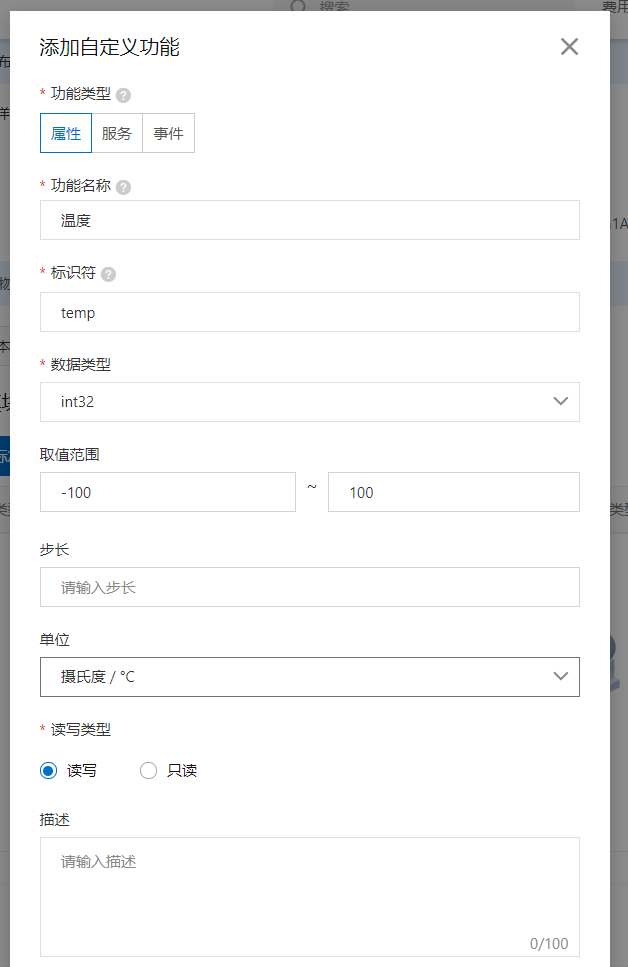
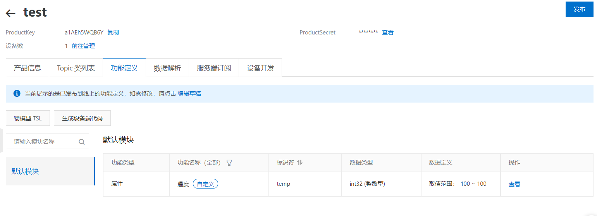
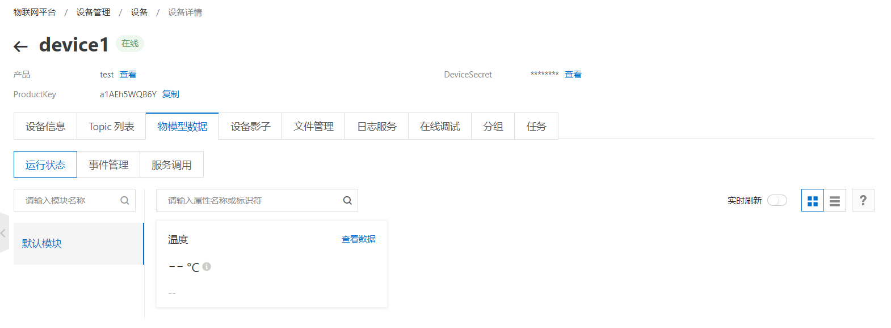
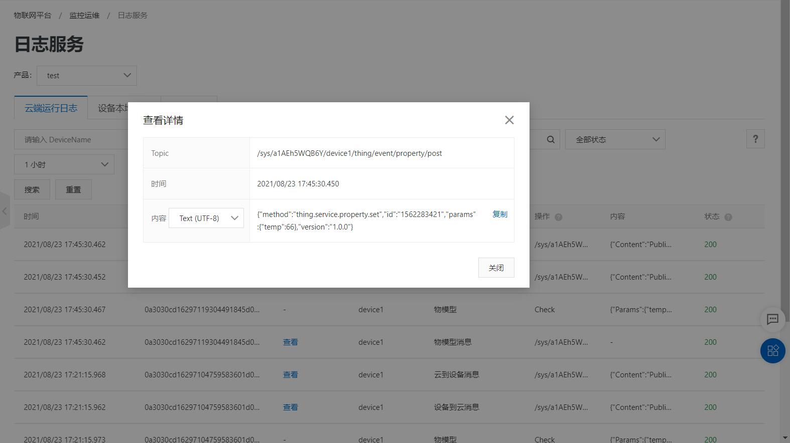
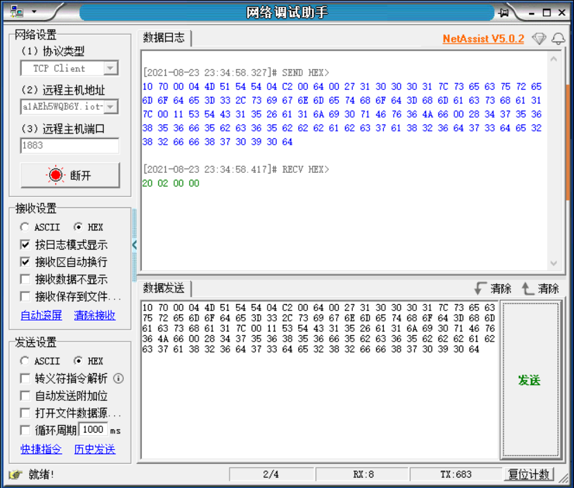

# 面向初学者的物联网全栈开发指南 - 3 - IOT平台和MQTT协议

在本章，我们将学习IOT平台的配置，通过阿里云物联网平台的文档认识IOT平台的特性，并学习在建立硬件侧到IOT平台线路过程中必不可少的MQTT协议。

通过此链接进入阿里云物联网平台[物联网平台 (aliyun.com)](https://iot.console.aliyun.com/lk/summary/new)，登陆支付宝账号，开通公共实例，进入公共实例后，在左侧栏的最后一项为官方文档，推荐通过以下链接开始学习，也可以直接参考本教程。平台中，产品为一类相同功能设备的集合，在这里可以批量管理所属不同产品的一类设备，而设备即一个单独的设备。

+ [概述 (aliyun.com)](https://help.aliyun.com/document_detail/131611.html)

+ [创建产品与设备 (aliyun.com)](https://help.aliyun.com/document_detail/73705.html)

## 1. 准备工具

+ MQTT.fx（阿里云链接：[Index of /apps/mqttfx/1.7.1 (jensd.de)](https://www.jensd.de/apps/mqttfx/1.7.1/?spm=a2c4g.11186623.0.0.679242356PKL1s)）
+ 哈希加密工具（百度搜索即可）
+ 快速上云工具（自制小工具，百度网盘：链接：https://pan.baidu.com/s/1rOJRhyrP0kcqkHrM50a_Iw  提取码：1ptt ）
+ 网络调试助手（官方链接：[NetAssist网络调试助手 V5.0.2-软件工具-野人家园 (cmsoft.cn)](http://www.cmsoft.cn/resource/102.html)）
+ 串口调试助手

## 2. 新建产品

依次选择：设备管理-产品-创建产品

1. 产品名称

2. 所属品类

   若选择标准品类，将自动创建预设的设备属性、TOPIC等；若选择自定义品类，设备属性等需要在创建后自行设置，建议选择自定义品类。

3. 节点类型

   默认选择直连设备即可。

4. 联网与数据

   联网设备为ESP8266，那么方式为WIFI；数据格式也选择默认的“ICA 标准数据格式”。

创建完毕后，我们查看产品详情，选择Topic类列表-物模型通信Topic，在这里我们可以通过属性上报的Topic实现硬件侧到IOT平台的数据上传，先有个印象，稍后会提到。


## 2. 添加设备

在左侧栏依次选择设备管理-设备，添加设备，产品为刚刚创建的产品，并输入设备名(Device Name)，在设备信息中我们可以看到设备处于未激活状态。到此为止我们在IOT平台中成功创建了一个设备位置，现在需要一个真实的设备连接这个设备位置，这样我们刚刚添加的设备将会被激活，处于正常工作状态。

在设备-DeviceSecret 查看-设备证书中，单击“一键复制”即可获取所谓的设备“三元组”（JSON格式）。

```json
{
  "ProductKey": "xxxxxx",
  "DeviceName": "device1",
  "DeviceSecret": "xxxxxxxxxxxxxxxxxxxxxxxxx"
}
```

在这里为没有接触过JSON的同学介绍一下，{}表示一个对象，对象有三个名称不同的值，三值的名称分别在冒号“:”的左侧，包括在双引号内，冒号的右侧为对应的值，可以为双引号括起来的字符串类型，数字类型，数组类型等，也可以是另一个对象。[JSON 教程 | 菜鸟教程 (runoob.com)](https://www.runoob.com/json/json-tutorial.html)

## 3. 准备信息

我们现在使用MQTT.fx软件模拟一个真实的设备，熟悉产品和设备的信息，验证前面步骤创建的正确性，具体MQTT.fx配置方式参照官方文档即可

+ 官方文档：[使用MQTT.fx接入物联网平台 (aliyun.com)](https://help.aliyun.com/document_detail/140507.html)

我们需要准备的东西有：

产品所属的：{ProductSecret}, {ProductKey}；

设备所属的：{DeviceName}, {DeviceSecret}；

IOT平台服务器地址：*${ProductKey}.iot-as-mqtt.cn-shanghai.aliyuncs.com*，对于公共实例，服务器地址都为华东2（上海），端口为1883;

Client Id：要求的格式为*${ClientID}|securemode=${Mode},signmethod=${SignMethod}|*，其中ClientID为您自定义的设备ID，安全模式为TCP直连，算法使用hmacsha1即可，因此只需填写一个变量, *${ClientID}|securemode=3,signmethod=hmacsha1|* ；

最后，密码为hmacsha1使用*${DeviceSecret}*加密后的

*clientId${clientId}deviceName${devicename}productKey${productKey}* 。

总结，我们使用创建产品、设备后系统生成的信息组合成MQTT连接参数：

```js
mqttclientId = ${clientId}|securemode=3,signmethod=hmacsha1|
mqttUsername = ${devicename}&${productKey}
mqttPassword = clientId${clientId}deviceName${devicename}productKey${productKey}
mqttPassword(hmacsha1) = 密钥为${DeviceSecret}
```

结合官方给出的文档，若所有配置信息填写正确，在MQTT.fx中单机connect，刷新页面，即可看到我们的设备已经在线。


## 4. TOPIC

+ [什么是Topic (aliyun.com)](https://help.aliyun.com/document_detail/73731.html)

### 4.1 编辑物模型

接下来，我们要让设备上传信息至IOT平台，假设我们的设备是一个环境检测装置，需要上传温湿度信息。

我们回到产品，在功能定义中编辑物模型，点击编辑草稿，添加自定义功能，按照如下填写



随后我们确定发布上线，再看到我们的产品物模型已经具有一个温度属性了。



回到设备“device1”，此时设备已经继承了产品刚刚更改的物模型，具备“温度”属性。



### 4.2 订阅TOPIC

我们需要TOPIC更改设备属性，查看设备的Topic列表，发现没有订阅的Topic，在调用Topic之前，每个设备都需要订阅特定的Topic，我们在创建产品时提到过Topic，若设置设备属性，则应该首先让设备订阅

+ /sys/${ProductKey}/${DeviceName}/thing/event/property/post

在MQTT.fx中，使用Subscribe功能，订阅该Topic，您同时可以注意到，Topic也可以取消订阅


### 4.3 发布到对应TOPIC

接着使用Publish功能，用刚才的Topic发送信息，数据格式为刚刚选择的ICA标准数据格式（Alink JSON），

+ 官方文档：[设备属性、事件、服务 (aliyun.com)](https://help.aliyun.com/document_detail/89301.htm?spm=a2c4g.11186623.0.0.12df7b1dw8j0kO#section-g4j-5zg-12b)

```json
{
    "method":"thing.service.property.set",
    "id":"1562283421",
    "params":
    {
        "temp":45
    },
    "version":"1.0.0"
}
```

其中“method”同Topic的后半部分；“id”为每条消息的自定义id，其实可以重复，但不建议重复，可以随机；“params”即需要设置的设备属性，把设备看作一个对象，对象里的值为设备的属性；“version”为固定部分。


发送完毕后，回到设备的物模型数据，可以看到


要善于运用IOT平台提供的各种工具，在日志服务中，可以看到刚刚发送到云平台的数据。



以上介绍了设备属性的上报链路，设备获取云平台的信息也可以用同样的方法，通过TOPIC发送（Publish）一条数据，读取来自IOT平台的返回值即可，通过MQTT.fx可以看到云平台的返回数据。

## 5. MQTT协议

在MQTT.fx软件中，协议已经被封装好了，只需要填写对应的产品、设备信息，在实际应用中我们要使用ESP8266发送基于MQTT协议的报文，协议格式比较简单，在这里分享一个b站上的教程视频

+ MQTT介绍（链接中的P30，P31）：[【超纬电子】ESP8266 SDK视频教程_哔哩哔哩_bilibili](https://www.bilibili.com/video/BV1k4411q7Cc?p=30)
+ MQTT3.1.1中文版：[MQTT 3.1.1 协议中文版 | MQTT中文网 (p2hp.com)](http://mqtt.p2hp.com/mqtt311)

总而言之，MQTT由HEX十六进制构成，分为报头和载荷两部分，固定报头首先指示了本条报文的功能，如在上文用到的Publish发送，Subscribe订阅，等，接着指示了报文的长度；可变报头按需填写；载荷包含长度和内容。

现在使用网络调试助手在PC模拟ESP8266发送完整MQTT协议内容做调试，协议类型为TCP Client，远程主机地址和端口如上文所述。下面介绍的报文均可使用我自制的快速上云工具一键生成，做的比较仓促，但是能用Orz。

+ 快速上云工具（自制小工具，百度网盘：链接：https://pan.baidu.com/s/1rOJRhyrP0kcqkHrM50a_Iw  提取码：1ptt ）

### 5.1 连接CONNECT

在连接到服务器内，我们有一段较短的时间可以向IOT平台服务端发送CONNECT连接报文，报文错误或超时都会导致服务端主动断开连接。

#### 报头

示例：10 <LENGTH> 00 04 4D 51 54 54 04 C2 00 64

##### 固定报头

**固定位** 10

**剩余长度字段**  <LENGTH>， *固定报头之后的所有字段长度*

##### 可变报头

**协议名** 00 04 4D 51 54 54

**协议版本** 04

**连接标志** C2 

**KeepAlive时长** 00 64, *表示系统在未收到设备消息的多长时间后自动断开连接，这里设置为100秒*

#### 载荷

<LENGTH> <LENGTH> ${mqttclientId} <LENGTH> <LENGTH> ${mqttUsername} <LENGTH> <LENGTH> ${mqttPassword(hmacsha1)}

载荷中的参数已在第三节给出，最后的mqttPassword是加密后的字符串，每项参数前面的两个字节表示该参数的长度。

#### 响应

**成功** 20 02 00 00



在连接指令发出，响应成功后，我们可以进行接下来的步骤了。

### 5.2 订阅SUBSCRIBE

正如前面提到的，TOPIC首先需要订阅才能使用。

#### 报头

示例：82 <LENGTH> 00 0A

##### 固定报头

**固定位** 82

**剩余长度字段**  <LENGTH>， *固定报头之后的所有字段长度*

##### 可变报头

00 0A

#### 载荷

<LENGTH> <LENGTH> ${TOPIC} <QoS>

其中QoS为服务质量等级， 00为无需认证，01为认证一次，02为至少认证一次，这里选择00无需认证即可。

#### 响应

**成功** 90 <LENGTH> <ID> 00 

### 5.3 发布PUBLISH （QoS0）

通过PUBLISH，向相应的TOPIC发送信息。

#### 报头

示例：30 <LENGTH> <LENGTH> <LENGTH> ${TOPIC}

##### 固定报头

**固定位** 30

**剩余长度字段**  <LENGTH>， *固定报头之后的所有字段长度*

##### 可变报头

**TOPIC** <LENGTH> <LENGTH> ${TOPIC}

#### 载荷

示例：{"id":"15","version":"1.0","params":{"Temp": 02,"Hum": 02,"Gas": 02},"method":"thing.event.property.set"}

载荷无需声明长度，载荷内容如4.3中所示。

### 5.4 PING

**报文** C0 00

**响应** D0 00

### 5.5 断开 DISCONNECT

**报文** E0 00

以上是对于MQTT协议简单的分析，掌握了MQTT的套路后可以根据官方协议手册自行取用。
