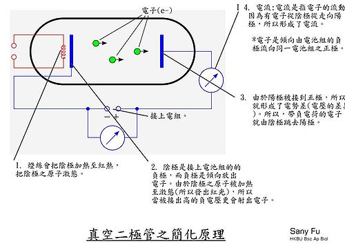
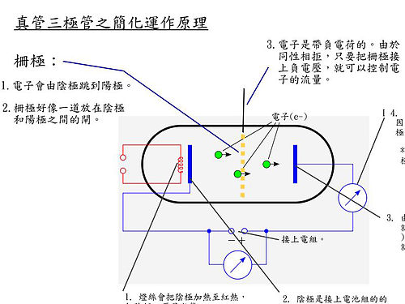
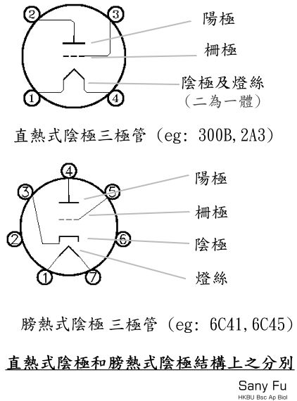
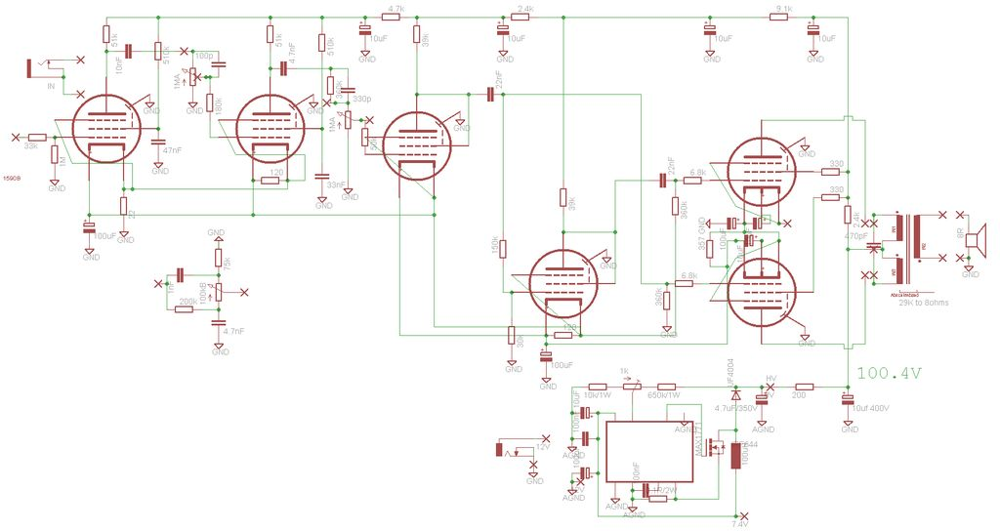
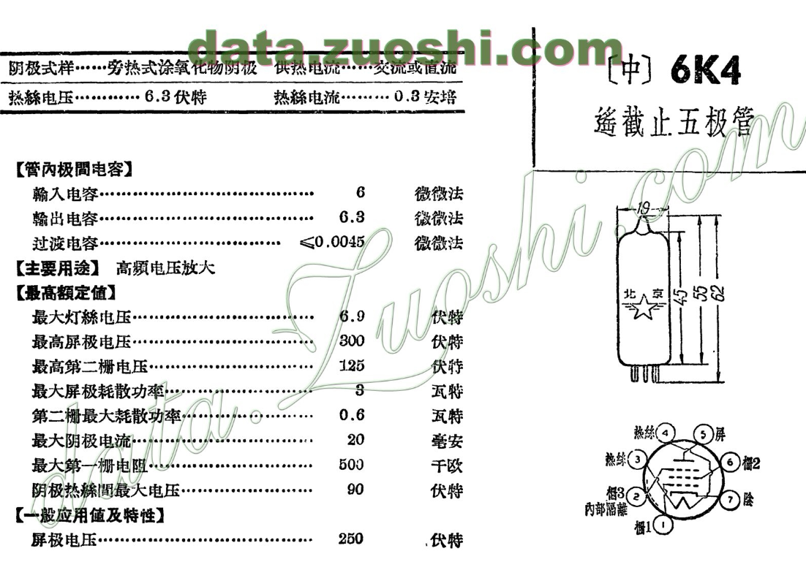
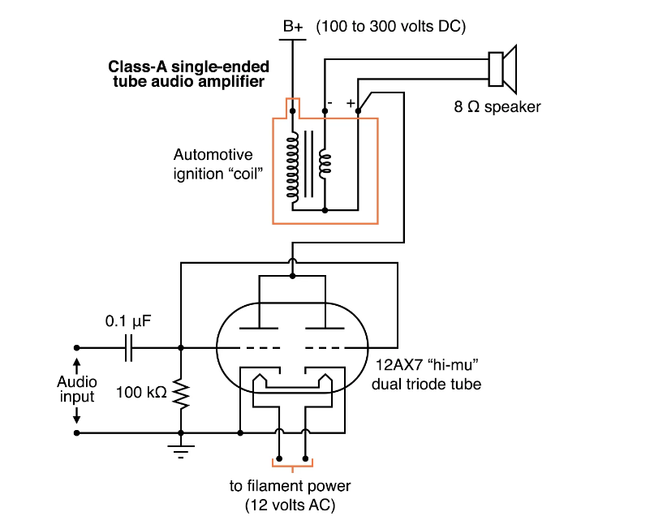
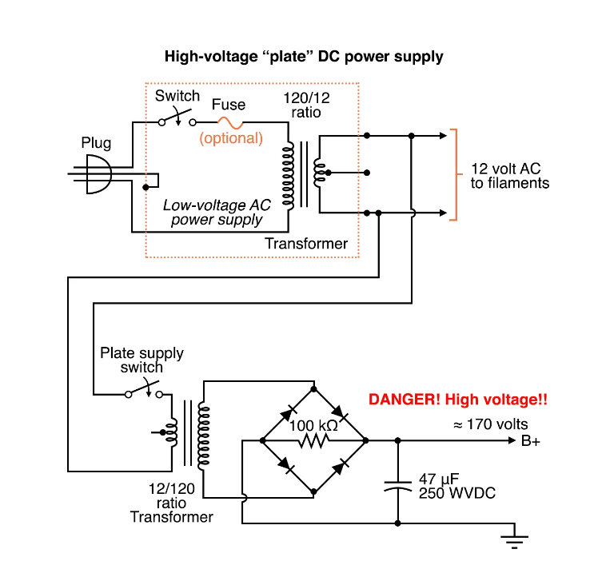
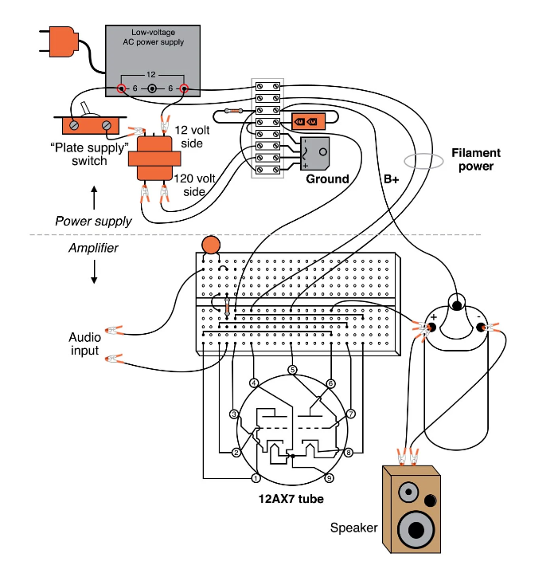
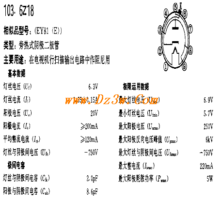

!!! note ""

    本项目作者：李崇嵘 

- [基本原理](#基本原理)
  - [二极管](#二极管)
  - [三极管](#三极管)
  - [四极管](#四极管)
  - [五极管](#五极管)
  - [外观检查](#外观检查)
  - [用万用表检测](#用万用表检测)
  - [电子管灯丝的供电方式](#电子管灯丝的供电方式)
- [产品及应用](#产品及应用)
  - [一、前级HIFI前置放大](#一前级hifi前置放大)
  - [二、 用6K4电子管制作调频收音头FM receiver with 6K4 tube](#二-用6k4电子管制作调频收音头fm-receiver-with-6k4-tube)
  - [三、电池供电的电子管放大器](#三电池供电的电子管放大器)
  - [四、 电子管6p13功放电路图](#四-电子管6p13功放电路图)
- [6K4](#6k4)
- [6Z18](#6z18)
- [选文：](#选文)
- [书籍](#书籍)

# 基本原理

真空管具有发射[电子](https://zh.wikipedia.org/wiki/電子)的[阴极](https://zh.wikipedia.org/wiki/阴极)（K）和工作时通常加上高压的[阳极](https://zh.wikipedia.org/wiki/阳极)或称屏极（P）。灯丝(F)是一种极细的金属丝，而电流通过其中，使金属丝产生光和热，而去激发阴极来放射电子。栅极（G）它一定置于阴极与屏极之间。栅极加电压是抑制电子通过栅极的量，所以能够在阴极和阳极之间对电流起到控制作用。

为保持管内的真空状态，真空管中设有一物件，称为除气剂。一般由钡、铝、镁等活泼金属合金制成。在抽出管中空气后，将管中各元件及除气剂加热至红热，这样就可以吸收管内电极所含之气体[[2\]](https://zh.wikipedia.org/wiki/真空管#cite_note-2)。利用一围绕管子之[高频](https://zh.wikipedia.org/wiki/高頻)[电磁场](https://zh.wikipedia.org/wiki/電磁場)而使除气剂迅速升华，除气剂就吸收管子中的气体。在反应过后，玻璃管内壁积存银色的除气剂披覆层。若把管体的玻璃管打破或漏气时，玻璃管内壁积存银色的除气剂便会退色，同时也表示该真空管不能被使用。

## 二极管

二极管的“整流”和“检波”，实质上是把双向的交流信号变为单向的直流信号，即在信号的正半周时，热阴极向阳极发射电子，二极管导通；在信号的负半周时，电场反向，阳极无法向阴极发射电子，二极管截止。共工作原理参见下面两图：

## 三极管

1907年，美国科学家福雷斯特制造出第一支真空三极管。

三极管原理并不复杂，在二极管的阴极和阳极之间再加增加一个“控制栅极”，就形成了三极管。因为控制栅极十分靠近阴极，栅极与阴极间施加负电场，阴极就不发射电子，栅极施加正电场，阴极就发射电子，而且可以通过控制栅极电压来控制电子束流的大小，从而实现“以小控大”的放大作用。输入信号加在栅极上，放大后的信号从阳极输出。

## 四极管

四极管：从上图分析可知，三极管的阳极承担了“加速电子”和“信号输出”两个任务，但二者相互矛盾，即：加速电子时希望阳极电压稳定，但输出信号靠的就是阳极电压变化。解决办法就是把这二个功能分开，阳极专门用于输出大信号，加速电子则另请高明：再增加一个叫栅极，即“帘栅极”或“屏栅极”，该栅极设置在控制栅与阳极之间，靠近控制栅。工作时加上固定的正电压，专门负责加速电子。如下图：

## 五极管

四极管又有新问题：电子束在屏栅极（帘栅极）的加速下，打到阳极时动能很大，会从阳极中轰出“二次电子”，这些电子在阳极和屏栅极之间，不知道何去何从。当然最终要看周边电极，谁电压高就往谁方向走。

在四极管中，阳极和帘栅极都是正电压。区别是：帘栅极电压是固定的，但阳极电压是随输出信号高低变化的。当阳极电压高时，电子仍旧返回阳极；但随着信号变化，阳极电压也可能会低于帘栅极，这时，二次电子毫不犹豫地飞向帘栅极。

这就坏了：减小了阳极电流，增加了帘栅极电流。帘栅极目的是加速电子，又不需要收集电子，真正收集电子的是阳极，只能奔赴阳极的电子才能在阳极电路中形成输出电流，起到放大作用。有人可能会说：没事，无非就是费点电嘛。但这种“负阻效应”将在放大信号时引发严重失真及自激振荡，导致四极管根本无法使用。还有可能会让帘栅极过热烧掉。

解决办法是：再增加一个栅极！加在帘栅极与阳极之间，叫抑制栅极，并与阴极相接。这样，帘栅极的加速电场，被抑制栅极隔开，二次电子回头一看，首先看见抑制栅极的零电位，没任何吸引力，只得乖乖地再飞回阳极。发明了“五极管”，电子管技术才真正进入实用阶段。

> https://zh.wikipedia.org/wiki/%E7%9C%9F%E7%A9%BA%E7%AE%A1
>
> https://zhuanlan.zhihu.com/p/145261497

## 外观检查

1．观察电子管顶部的颜色 正常的电子管，其顶部的颜色是[银](https://baike.baidu.com/item/银)色或黑色。若顶部已变成乳白色或浅黑色，则说明该电子管已漏气或老化。

2．观察管内是否有杂物 轻轻摇动或用手指轻弹电子管玻壳，再上下颠倒几下仔细观察内是否有碎片、白色氧化物、碎云母片等杂物。若电子管内有杂物，则说明该管经过居中烈振动，其内部极间短路的可能性较大。 [7] 

## 用万用表检测

1．测量灯丝[电压](https://baike.baidu.com/item/电压) 用[万用表](https://baike.baidu.com/item/万用表)R×1档，测量电子管的两个灯丝引脚的电阻值，正常值只有几欧姆。若测得阻值为无穷大，则说明该电子管的灯丝已断。

2．检测电子管是否衰老 通过用万用表测量电子管阴极的发射能力，即可判断出电子管是否衰老。检测时，可单独为电子管的灯丝提供工作电压（其余各极电压均不加），预热2min左右，用万用表R×100档，红表笔接电子管极阴，黑表笔接栅极（表内1.5V电池相当于给电子管加上正偏栅压），测量栅、阴极之间的电阻值。正常的电子管，栅、阴极之间的电阻值应小于3kΩ。若测得电子管栅、阴极之间的阻值大于3 kΩ，则说明该电子管已衰老。该电阻值越大，电子管的衰老程度越严重。

## 电子管灯丝的供电方式

简单的说[电子管](http://www.elecfans.com/article/ic/)灯丝的作用是加热阴极，使阴极[电子](http://www.elecfans.com/soft/special/)更容易逃脱阴极飞向阳极，使电子管得以正常工作（也有的电子管的灯丝同时也是阴极，称直热式电子管）。所以，通俗的讲电子管的灯丝就像电炉子里面的电炉丝一样是一个把电能转化为内能的装置！ 

所以灯丝既可以用直流（DC）供电，也可以用交流（AC）供电！ 

DC供电噪音小，但对管子的寿命有一定的影响（基本只存在于直热式电子管），而且[电路](https://bbs.elecfans.com/zhuti_dianlu_1.html)成本增加。 
AC供电对管子寿命没有影响，电路简单，但是容易引起噪音。 

既然两者不能兼顾，那什么时候采用DC供电，什么时候采用AC供电呢？ 

一般情况下，前级管增益大，如常用的12AX7或6AX7的μ值将近100，其增益非常大，用其做放大电路放大倍数在50倍以上，如两级放大的话放大倍数达50×50=2500倍。所以前级放大信噪比很重要，尤其是用电子管作成的失真电路，很小的噪音干扰都会被放大为很明显的交流声。所以灯丝必须采用直流供电！当然引起噪音的因素很多，如地线的处理也非常之重要。 

一般情况下，后级管增益小，[电流](http://www.elecfans.com/tags/电流/)大，主要担任功率放大。而且灯丝电流也相对大，整流稳压相对复杂。所以常采用AC供电。
参考链接：http://www.[pi](http://www.elecfans.com/tags/pi/)ca[vr](http://www.elecfans.com/vr/441329.html).com/news/2009-08/1177.htm

# 产品及应用

## 一、前级HIFI前置放大

https://item.jd.com/10035177275380.html

## 二、 用6K4电子管制作调频收音头FM receiver with 6K4 tube
http://www.dzdiy.com/html/201106/29/FM-receiver-with-6K4-tube.htm

## 三、电池供电的电子管放大器

https://www.elecfans.com/d/1050207.html

## 四、 电子管6p13功放电路图

https://www.sgss8.com/tpdq/20566890/1.htm

# 6K4

6K4，旁热式氧化物阴极遥截止五极管。
主要用途：高频或中频电压放大。
7脚管。
基本数据：
灯丝电压：6.3V 电流0.3A
屏极电压：250V 电流10mA
第二栅电压：100V 电流5.5mA
跨导：4.4

> 收音机用电子管。遥截止电子管——顾名思义，就是截止比较遥远之意思。主要是为了供给超外差收音机的放大之用而设计出来。从30年代起，超外差接收机开始广泛普及，对于微弱的讯号，人们可以放大成千上万倍。随着通讯频率向短波迈进，衰落问题成为需要解决的重要课题，通过在高频、中频放大电路中增加AGC来减小衰落造成的影响成为一个最好的方法。故此需要有这样一种电子管，在小的栅极负电压下，可以有较高的跨导获得比较高的放大增益；在大的栅负压下，并不截止，而是仍然有小小的屏流。故此，通过绕制栅极丝时候特别绕法，制造出来遥截止五极管来供给通讯机使用。
>     相同构造的遥截止和锐截止五极管，比如58和57比较，除了截止的特性不相同以外，其它的参数也不相同。以57和58比较，57的内阻要高于58，这主要是因为为了获得遥截止的特性，58的栅极丝中间绕的比较疏落，不如57致密所导致。也因为此，58的屏极电流要比57高一些。同样的6J7和6K7也有如上的区别。有些朋友希望用五极管作为音频电压放大使用，在找不到锐截止五极管的时候，用遥截止五极管代用。从理论上来说是并不合适的。电子管放大器之中，造成大信号失真的一个重要的原因就是三极管中的变μ现象和五极管中的变S现象。这是造成大信号失真的一个原因，虽然程度有所不同，不过一般而言，还是不用遥截止电子管作为音频放大为好。有朋友要问：6B8P电子管的五极管部分是遥截止特性，不是一样用于音频放大么？抑或许多的书籍资料中的电路中也多见到遥截止五极管用于音频放大的线路。我这里要说明：不论是6B8P用于音频放大，或者是别的遥截止电子管用于音频放大，不是不能用，而是不算好。当然这样使用也不会出现危险，但是大信号输入就绝对会有失真。有些朋友认为：将遥截止五极管作为三极管连接使用，便没有问题。这也是错误的，遥截止的五极管作为三极管连接，它的截止特性仍然是遥截止的，因为三极管接法并不能让管子内部的栅极丝有任何改变，所以仍然不适合用于音频放大电路。我曾经用6K4接成三极管试验过，线性不好，用示波器清晰可见。

http://www.r-type.org/exhib/abh0213.htm

https://www.allaboutcircuits.com/textbook/experiments/chpt-5/vacuum-tube-audio-amplifier/

https://audioxpress.com/article/your-can-diy-a-25w-otl-tube-amplifier  (电路很详细)

# 6Z18

> **电子管之常见阻尼管**
>     介绍完几种常见的整流管以后，我先说一下阻尼管。主要是考虑到阻尼管仍然属于高真空二极管的范畴，并且我们常常能够接触到这种管子。而且在某种程度而言还是有一定作用。
>     阻尼管和常见的整流管既有联系又有区别。首先，阻尼管工作在脉冲电路之中，在瞬间会有高电压和大电流流经电子管，同时阻尼管的内阻也要很小。 
>     在电视机发展的早期，并没有专用的阻尼管，也没有专用的行输出管。最常用的行输出管是807，最常用的阻尼管是5V4。5V4是大电流的全波整流管，在作为行输出管使用的时候是两个屏极并联运用，和其他整流管比较，5V4是最合适的型号。5Y3、80、5W4等等电子管的耐压不够高，作为阻尼管有打火的可能。5Z3、5R4电子管虽然耐压比较高，但是因为内阻比较大，故此并不合用。5V4作为阻尼管要比其他整流管合适。
>
> ​    随着电视机技术的进步，为了让电视机获得更加优异的性能，许许多多新型的电视机用电子管被开发出来，807不再是电视机中用得最多的行输出电子管，5V4也不再作为阻尼管来使用。美国在二战以后开发了6U4GT和6W4GT是率先作为阻尼管用于电视机之中，随后又有6AX4等电子管问世，作为早期电视机中用的很多的阻尼管。同时荷兰 
> 飞利浦公司开发的是EY81、PY81、EY88等型阻尼管也得到非常广泛的应用。我国的产品有6Z18和6Z19，也是属于类似的管子。
>   观察这些管子，有几个非常显著的特征。
> ​    首先，这些管子都是旁热管，因为电视机之中常常是串联运用灯丝、并且阻尼管需要有非常高的发射效率，这些原因导致阻尼管都是旁热管。并且阻尼管的灯丝都是属于特殊品种，对于阴极的耐压要比其它旁热管高很多。
>
>    其次，阻尼管的阴极很大，灯丝电流也大，并且屏极也很大、屏极都采用敷铝铁屏极。这样阻尼管可以容许更大脉冲电流，而不会产生过热。
>
> ​      此外，有些阻尼管为了可以允许更高的脉冲电压，采用栅帽引出阴极。这是为了防止管座上面容易产生的打火现象。
>
> ​     阻尼管可以用于普通的整流电路之中，可以获得良好的效果。比如国产的6Z18,6Z19电子管，就非常合适用于整流电路，有些朋友在自制的扩音机中用阻尼管整流，效果不错。因此有些商人将廉价的阻尼管作为昂贵的大电流整流管出售，诸位还需多多注意此问题。
>

# 选文：

1. 电子管基础知识  https://tech.hqew.com/circuit_2002773  （讲解电子管发展历程和应用，非常深入）
2. ...

# 书籍

[电子管收音机  甘泉 辽宁人民出版社1928.pdf ](http://cache.amobbs.com/bbs_upload782111/files_32/ourdev_572678.pdf)

真空管的应用_上海科学技术出版社_1959.pdf

业余袖珍收音机_人民邮电出版社_1964.pdf

业余电子管收音机设计_人民邮电出版社_1964.pdf

世界电子管电路手册（增订本）_香港万里书店_1979.pdf

业余收音机电路图集_人民出电出版社_1964.pdf

